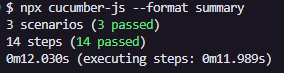

# Testes End-to-End


## Ferramentas Utilizadas
- **Framework**: 
- **Versão Playwright**:  

- **Versão Node.js**:  

- **Cucumber**:  
- **Linguagem do Projeto**: 

## Descrição

Este projeto tem como objetivo a automação de testes utilizando a combinação de Cucumber e Playwright, proporcionando uma estrutura clara e organizada para a criação e execução de testes end-to-end.

## Aplicação Web utilizada nos testes
Sauce Demo é uma aplicação web que simula um e-commerce, proporcionando um ambiente ideal para realizar testes automatizados de funcionalidades de compra, checkout e gerenciamento de produtos.

## Executar os testes
Para executar os testes com o Cucumber, utilize o seguinte comando:

```bash
npx cucumber-js --format summary
```
